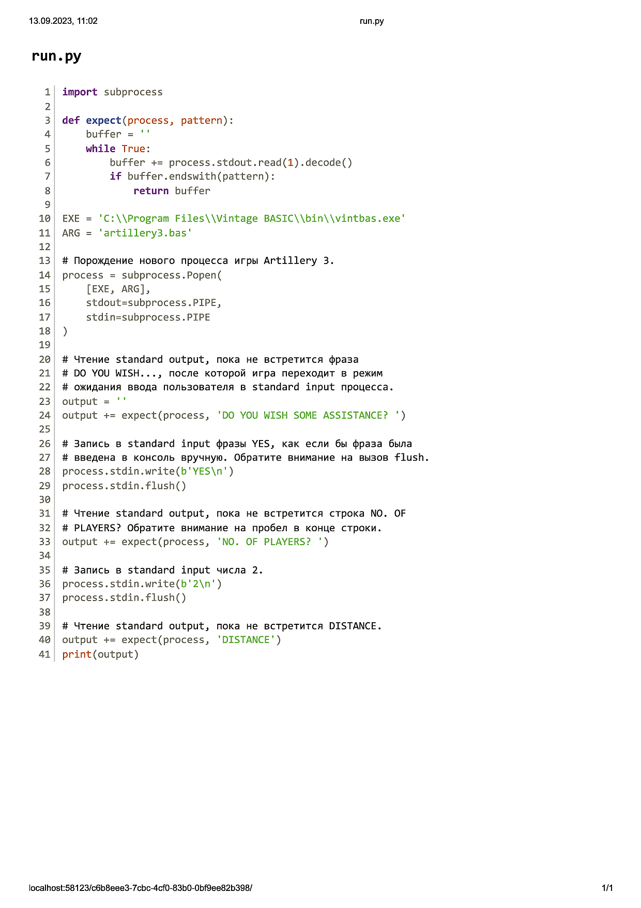

# Автоматическое тестирование

> День добрый!
>
> Высылаю пример реализации взаимодействия с процессом, который читает из stdin/пишет в stdout, на языке Python (см. файл proctests.pdf). Идея автоматического тестирования утилиты командной строки на соответствие эталонной реализации состоит в том, чтобы запустить показанным в PDF способом два дочерних процесса:
>
> 1. Оригинальная игра на BASIC из списка https://www.roug.org/retrocomputing/languages/basic/morebasicgames согласно таблице https://docs.google.com/spreadsheets/d/1lJjgcjA9nwMbE0e_jkPESyospLpWs_SldJHtu1IKfI4/edit?usp=drivesdk, используя интерпретатор Vintage Basic http://www.vintage-basic.net/download.html
> 2. Ваш кроссплатформенный порт игры.
>
> Далее автоматически выполняется чтение stdout этих двух дочерних процессов, запись в stdin процессов одного и того же пользовательского ввода, сравнение поведения двух программ (их вывода в stdout). Таким образом выполняется верификация, что программы ведут себя одинаково. Подобную систему тестирования программы на соответствие эталону можно реализовать на любом языке, в Go Вам помогут модули io и os/exec, в NodeJS пригодится модуль child_process https://nodejs.org/api/child_process.html. Генераторы случайных чисел RND можно заменить константами.
>
> 